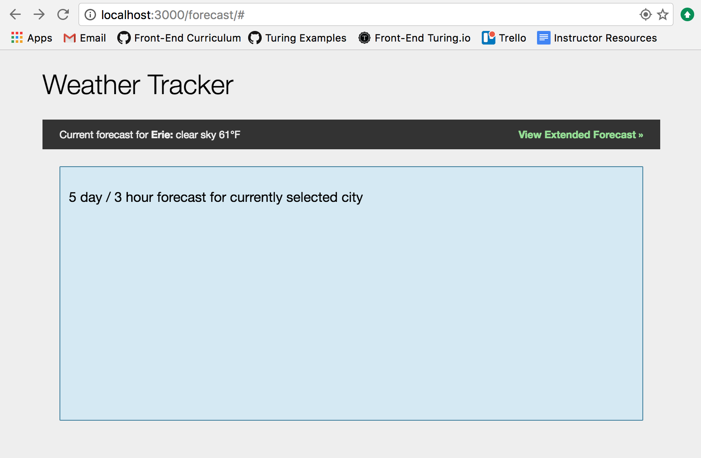

## Specification

### Overview

In this project you'll be building a react/redux weather app that allows you to see different forecast information for a given city, and set favorite cities to pin to the home page.

### Main Goals

  - Retrieve and display forecast data from the OpenWeatherMap API 
  - Use the Geolocation API to determine the weather in your current city 
  - Save "pinned" or favorite cities to display their weather 

## Setup

### Obtain an API Key

We'll be using the OpenWeatherMap API to retrieve weather data. You'll need to [sign up for an API key](http://openweathermap.org/appid) to make any data requests.

### Repo
Webpack and react dependencies have been setup for you in the [weather-app repo](https://github.com/turingschool-examples/weather-forecast). Fork this repo and follow the setup instructions in the README.

### General Requirements

  - Use the [Geolocation API](https://developer.mozilla.org/en-US/docs/Web/API/Geolocation/Using_geolocation) to determine your current city. You may be prompted by your browser to grant access to your location. This request can take some time, and it might not be 100% accurate, but it should provide you with enough information to get the weather forecast using the [OpenWeatherMap API](https://openweathermap.org/api).
  - Create a header bar that displays your current city's temperature (in Fahrenheit) and weather description (e.g. 'windy', 'rainy', 'sunny')
  - Create a `/settings` route that displays an input field to enter a city's zip code and save it as a "pinned" city
  - Create a dashboard/index page that shows the Current Weather for a maximum of 3 "pinned" cities. If there aren't 3 pinned cities, add a placeholder with a link to "Pin a new city"
  - Each pinned city forecast should include a link to display an extended 5 day/3 hour forecast. The route for the extended forecast should be something like `/forecast/<cityId>`.

### Wireframes
Dashboard Page:

Settings Page

Extended Forecast Page

## Rubric

### Specification Adherence

* 4 - The application meets all of the requirements listed above and implements one or more of the extensions.
* 3 - The application consists of one page with all of the major functionality being provided by React. No approach was taken that is counter to the spirit of the project and its learning goals. There are no features missing from above that make the application feel incomplete or hard to use.
* 2 - The application is in a usable state, but is missing 1 or more of the features outline in the specification above.
* 1 - The application is missing 3 or more smaller features or 1 major feature essential to having a complete application.
* 0 - The application is unusable.

### Redux Architecture

* 4 - Appropriate components are wrapped in connected Redux components. The Redux store contains all necessary application data and nothing more. All state changes are handled through Redux actions and reducers.
* 3 - At least one component is not connected with Redux appropriately. Application state is mutated by more than just Redux. The Redux store is missing application data that it should be handling.
* 2 - Application state is mostly outside the control of Redux. Application did not make use of Redux actions and reducers to mutate state. Components do not demonstrate a clear understanding of stateful vs. statelessness.
* 1 - Application does not make use of Redux to manage state. There are little or no connected components.

### Routing

- 4: Application is a single page and uses React Router to display appropriate components based on URL.
- 3:  Application dashboard shows the correct components, but navigating to another URL does not display correctly.
- 2:  Application dashboard shows the correct components, but is unable to navigate to other pages.
- 1:  Application did not use a Router

### JavaScript Style

* 4 - Application has exceptionally well-factored code with little or no duplication and all components separated out into logical components. There _zero_ instances where an instructor would recommend taking a different approach.
* 3- Application is thoughtfully put together with some duplication and no major bugs. Developer can speak to choices made in the code and knows what every line of code is doing.
* 2 - Your application has some duplication and minor bugs. Developer can speak to most choices made in the code and knows what every line is doing.
* 1 - Your application has a significant amount of duplication and one or more major bugs. Developer cannot speak to most choices and does not know what every line of code is doing.

### Testing

* 4 - Project has a running test suite that exercises the application using Enzyme. The test suite covers almost all aspects of the application including the Redux actions and reducers.
* 3 - Project has a running test suite that tests and multiple levels but fails to cover some features. All functionality is covered by tests. The application makes some use of feature testing.
* 2 - Project has sporadic use of tests and multiple levels. The application contains numerous holes in testing and/or many features are untested.
* 1 - There is little or no evidence of testing in this application.

### Workflow

* 4 - The group effectively uses different Git branches and many small, atomic commits that document the evolution of their application and who was responsible for what features.
* 3 - The group makes a series of small, atomic commits that document the evolution of their application.
* 2 - The group makes large commits covering multiple features that make it difficult for the evaluator to determine the evolution of the application.
* 1 - The group committed the code to version control in only a few commits. The evaluator cannot determine the evolution of the application.
* 0 - The application was not checked into version control.